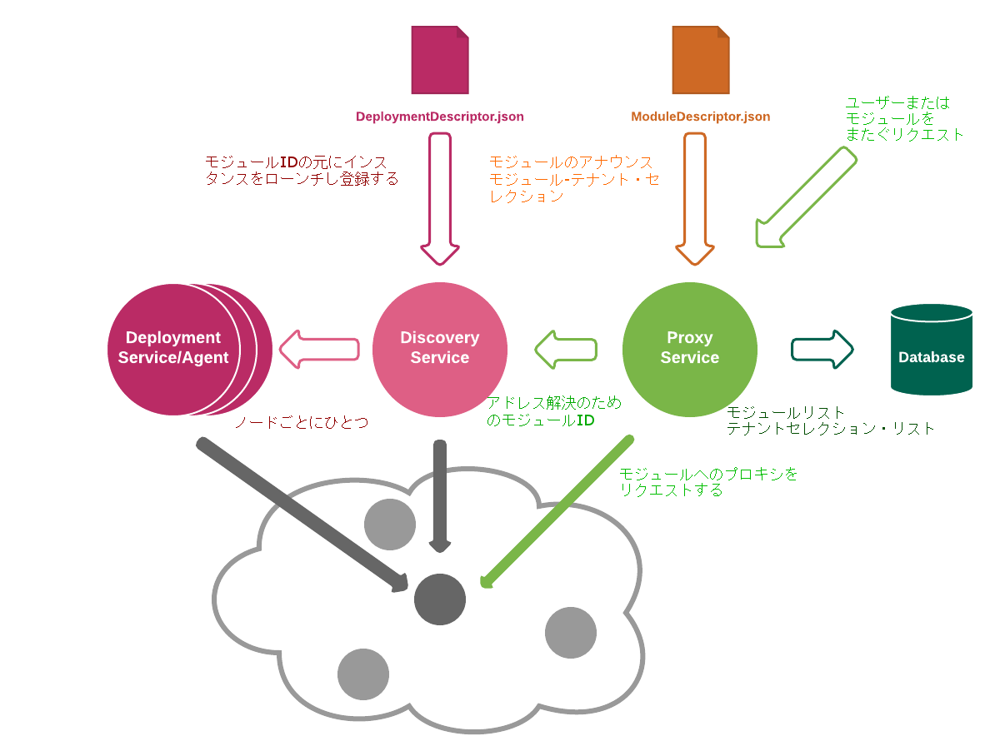

# Okapiガイドとリファレンス

これはマイクロサービスの管理と実行のゲートウェイである、
Okapiのガイドとリファレンスです。

<!-- `make guide-toc.md`を実行し、その出力をここに含めて、必要に応じてこれを再生成します -->
* [Introduction](#introduction)
* [Architecture](#architecture)
    * [Okapi's own Web Services](#okapis-own-web-services)
    * [Deployment and Discovery](#deployment-and-discovery)
    * [Request Processing](#request-processing)
    * [Status Codes](#status-codes)
    * [Header Merging Rules](#header-merging-rules)
    * [Versioning and Dependencies](#versioning-and-dependencies)
    * [Security](#security)
    * [Open Issues](#open-issues)
* [Implementation](#implementation)
    * [Missing features](#missing-features)
* [Compiling and Running](#compiling-and-running)
* [Using Okapi](#using-okapi)
    * [Storage](#storage)
    * [Curl examples](#curl-examples)
    * [Example modules](#example-modules)
    * [Running Okapi itself](#running-okapi-itself)
    * [Example 1: Deploying and using a simple module](#example-1-deploying-and-using-a-simple-module)
    * [Example 2: Adding the Auth module](#example-2-adding-the-auth-module)
    * [Example 3: Upgrading, versions, environment, and the `_tenant` interface](#example-3-upgrading-versions-environment-and-the-tenant-interface)
    * [Example 4: Complete ModuleDescriptor](#example-4-complete-moduledescriptor)
    * [Multiple interfaces](#multiple-interfaces)
    * [Cleaning up](#cleaning-up)
    * [Running in cluster mode](#running-in-cluster-mode)
    * [Securing Okapi](#securing-okapi)
    * [Module Descriptor Sharing](#module-descriptor-sharing)
    * [Install modules per tenant](#install-modules-per-tenant)
    * [Upgrading modules per tenant](#upgrading-modules-per-tenant)
* [Reference](#reference)
    * [Okapi program](#okapi-program)
    * [Environment Variables](#environment-variables)
    * [Web Service](#web-service)
    * [Internal Module](#internal-module)
    * [Deployment](#deployment)
    * [Docker](#docker)
    * [System Interfaces](#system-interfaces)

## Introduction

この文書では、Okapiに関連する以下の概念の概要を提供することを目的としています。

Okapiとその周辺のエコシステム全体（例：コアとモジュール）
Okapiの実装の詳細とOkapiの使用：具体的なWebサービスのエンドポイントとリクエスト処理
（リクエストとレスポンスエンティティの処理、ステータスコード、エラー条件など）の詳細の説明

Okapiは、マイクロサービスアーキテクチャに一般的に使用される、いくつかの異なるデザインパターンを実装しています。
それらの最も中心的なものは、Okapiコアの 'proxy'サービスによって実装されている、
いわゆる「APIゲートウェイ」パターンです。

概念的には、APIゲートウェイは、システムの単一のエントリーポイントとなるサーバーです。
これはオブジェクト指向デザインの[ファサードパターン]（http://en.wikipedia.org/wiki/Facade_pattern）
と同様です。
Okapiが非常に厳密に従っている[標準定義]（https://www.nginx.com/blog/building-microservices-using-an-api-gateway/）
によると、API Gatewayは、内部システムのアーキテクチャをカプセル化し、
各クライアントに合わせた、統合されたAPIを提供します。
次のコアの役割も含まれるでしょう。
認証、監視、ロードバランシング、キャッシング、リクエストの整形と管理、
スタティックなレスポンスのハンドリング_：
複数のリクエストへのブロードキャストとファイナル・レスポンスを返すことを可能にする
メッセージ・キュー・デザインパターン（当初は同期的かつ最終的にはおそらく、非同期で。）
最後に、Okapiはサービス・ディスカバリー・ツールとしての役割を果たすことによって、
サービス間のコミュニケーションを容易にします：サービスBと話したいサービスAが知っている必要があるのは、
HTTPインタフェースだけです。
Okapiが利用可能なサービスのレジストリを検査して、サービスの物理的なインスタンスを特定するからです。

Okapiは設定可能で拡張可能であるように設計されています。
ソフトウェア自体のプログラム的な変更をすることなく、
Webサービスエンドポイントを新規で公開したり、
既存の品質を良くしたりすることができます。

OkapiコアWebサービスをコールすることで、新しいサービス（Okapiから見た'modules'）の登録が行われます。
登録および関連するコア管理タスクは、サービス・プロバイダ・アドミニストレーターによって実行されます。
この設定可能性と拡張性により、アプリストアでテナントごとに
オンデマンドでサービスまたはサービス・グループ（「アプリケーション」）を有効または無効にすることができます。


## Architecture

OkapiのWebサービス・エンドポイントは、おおよそ2つに分けられます：
（1）時に「コア」と呼ばれる一般モジュールとテナント管理API - 当初はOkapi自体の一部でしたが、独立したサービスになるかもしれません
（2）モジュールが提供するビジネスロジック特有のインターフェースにアクセスするためのエンドポイント
例：パトロン管理またはサーキュレーション。 
このドキュメントでは、前者の詳細と、後者の許可されたフォーマットとスタイルの一般的な概要を提供します。

現在のフォームでは、コアなOkapiウェブサービスの仕様は、[RAML]（http://raml.org/）
（RESTful APIモデリング言語）を取り込んでいます。 [参考文献]（＃web-service）セクションを参照してください。 

しかし、この仕様では、特定のモジュールによって公開される実際のAPIエンドポイントについてはアサンプションをほとんどたてておらず、
基本的に未定義にしています。 目標は、共通トランスポートプロトコル（HTTP）の基本要件のみで、
それらのAPI（RESTful vs RPCとJSON vs XMLなど）のさまざまなスタイルとフォーマットを許可することです。

いくつかの特殊なケース（例えば、メッセージキューと同様の動作のための真の非同期プロトコルのようなバイナリプロトコルなど、
非HTTPを統合する能力）に関して、トランスポートプロトコルのアサンプションは解除されるか、回避されることが思い描かれています。


### Okapi's own Web Services

前述のように、Okapi独自のWebサービスはモジュールの設定、構成、有効化、テナントの管理のための基本的な機能を提供します。 
コア・エンドポイントは次のとおりです。

 * `/_/proxy`
 * `/_/discovery`
 * `/_/deployment`
 * `/_/env`

特別な接頭辞 `/_` はモジュールによって提供される拡張ポイントから
Okapi内部のWebサービスへのルーティングを区別するために利用されます。

 *  `/_/proxy` エンドポイントはプロキシサービスの設定に使用されます：
    私たちが知っているモジュール、リクエストがどのようにルーティングされるべきか、
    私たちが知っているテナント、どのモジュールがどのテナントで有効になっているかを特定します。
    
 * `/ _ / discovery`エンドポイントは、クラスタ上のサービスIDからネットワークアドレスへのマッピングを管理します。
    情報がそこにポストされ、プロキシサービスがそれを照会して、必要なモジュールが実際に利用可能な場所を見つけます。 
    また、モジュールを一気にデプロイしてレジスターするためのショーカットを提供します。
    クラスタ内のノードを全てカバーする検出エンドポイントは1つしかありません。
    ディスカバリ・サービスへのリクエストはモジュールを特定のノード上にデプロイすることもできます。そのため、
    デプロイを直接呼び出すことが必要になることはほとんどありません。

 * `/ _ / deployment`エンドポイントはモジュールの配備を担当します。
    クラスタ化された環境では、各ノードで実行されているデプロイメント・サービスは一つであるべきです。
    そのノードでプロセスを開始し、さまざまなサービスモジュールにネットワークアドレスを割り当てる役割を担います。
    これは、ほとんどがディスカバリ・サービスによって内部で利用されますが、
    一部のクラスタ管理システムはそれを利用することができるように開かれています。

 * `/ _ / env`エンドポイントは、デプロイ時にモジュールに渡されるシステム全体のプロパティである
    環境変数を管理するために使用されます。

これら4つの部分は別々のサービスとして実装されています。
そのため、代替のデプロイとディスカバリー方法を使用することが可能です。
もし選択したクラスタリングシステムがそのような方法を提供しているのであれば。



#### What are 'modules'?

Okapiエコシステム内のモジュールは、コンテンツよりもふるまい（つまり、_interface contract_の観点から定義されます。
パッケージまたはアーカイブとしてのモジュールの正確な定義がないことを意味しています。
例えば、基礎となる標準化されたファイル構造があること。
これらの詳細は特定のモジュール実装に委ねられています（前述の通り、
Okapiのサーバー側モジュールは、あらゆるテクノロジー・スタックを利用できます）。

したがって、以下の特性が明らかになっているソフトウェアは、Okapiモジュールになり得ます：

* RESTスタイルのWebサービス・プロトコル（通常は、必須ではありませんが、JSONペイロードを使用します）を利用するHTTPネットワークサーバーであること。

* デスクリプタ・ファイル、すなわち
[`ModuleDescriptor.json`]（../ okapi-core / src / main / raml / ModuleDescriptor.json）、
これはモジュールの基本的なメタデータ（id、nameなど）を宣言し、
モジュールの他のモジュール（正確にはインタフェース識別子）との依存関係を指定し、
すべての"提供された"インターフェースにレポートすること。

* `ModuleDescriptor.json` がすべての `routes` (HTTP パスとメソッド)のリストを持っていること。
ルートは与えられたモジュールがハンドルすることで、モジュールへトラフィックをプロキシするために必要な情報をOkapiに提供します。
(これは単純化されたRAML仕様と同様です。)

* この章で定義されているバージョン管理規則に従っていること。
[_Versioning and Dependencies_](#versioning-and-dependencies).

* WIP: 監視と計装に必要なインタフェースを提供すること。

ご覧のとおり、これらの要件のいずれもデプロイメントのルールを明確に述べているわけではありません。
そのため、第三者ウェブサービス（例えば、公的にアクセス可能なインターネットサーバのAPI）
をOkapiモジュールとして統合することが完全に可能となります。

つまり、エンドポイントスタイルの過程を立てることと、バージョン管理の
セマンティクスは、Okapiで必要とされるものによく似ています。
それを記述するのに適切なモジュール記述子を書くことができます

ただし、Okapiには、自身が管理するクラスタ上で、Okapiがサービスのネイティブな起動、実行、監視を可能にする
追加のサービスが含まれています（サービス・デプロイメントとディスカバリー）。

それらの_ネイティブモジュール_初以下の記述子ファイル
[`DeploymentDescriptor.json`]（../ okapi-core / src / main / raml / DeploymentDescriptor.json）を必要します。
これはモジュールの実行方法に関する低いレベルの情報を指定します。 
また、ネイティブ・モジュールは、Okapiのデプロイメント・サービスでサポートされている
パッケージオプションの1つに従ってパッケージ化する必要があります：
この時点では、各ノードの実行可能ファイル（およびすべての依存ファイル）または自己完結型
Dockerイメージを使用して、中央から実行可能ファイルを配布します。


#### API guidelines

Okapiの独自のWebサービスは必須で、その他のモジュールは推奨として、
実際に可能な限りこれらのガイドラインに準拠する必要があります。

 * パスの後続のスラッシュは書かないこと
 * 常に適切なJSONを期待して返す
 * 主キーは常に 'id'と呼ばれるべきである

私たちは、Okapiのコードを模範的なものにすることで、
他のモジュール開発者がエミュレートする例としようとしています。

#### Core Okapi Web Service Authentication and Authorization

コアサービス（ `/ _ /`パスの下のすべてのリソース）へのアクセスはサービスプロバイダ（SP）管理者に付与されます。
これらのサービスが提供する機能は、複数のテナントにまたがっているためです。

SP管理者の認可と認証の詳細は後の段階で定義されるべきであり、
特定のサービスプロバイダの認証システムにフックできる外部モジュールによって提供される可能性が高いです。

### Deployment and Discovery

複数のステップからなるプロセスによって、テナントがモジュールを利用できるようになります。
いくつかの異なる方法で実行されますが、最も一般的なプロセスは次のとおりです:

 * ModuleDescriptorを `/ _ / proxy`にポストし、私たちがそのようなモジュールについて知っていること、
 それが提供するサービス、およびそれが依存するものをOkapiに伝えます。

 * `/ _ / discovery`に、任意のノードで実行したいモジュールにPOSTし、
 そのノードのデプロイ・サービスに必要なプロセスを開始するように伝えます。

 * 特定のテナントに対してモジュールを有効にします。

外部の管理プログラムがこれらの要求を行うと仮定しています。 
適切なOkapiモジュールそのものではありえません。なぜならモジュールがデプロイされる前に実行される必要があるからです。
テストについては、本書の後半にあるcurlコマンドライン[examples]（＃using-okapi）を参照してください。

別の方法として、モジュールIDではなく、完全なLaunchDescriptorをディスカバリーに渡す方法があります。
この場合、ModuleDescriptorはLaunchDescriptorさえも持ちません。 
これはかなり異なるノードのクラスターで実行されている場合や、ファイルの場所を正確に把握したい場合に便利です。
これはOkapiクラスターの実行方法として考えている方法ではありませんが、選択肢は開かれたままにしておきたいと考えています。

もう一つの代替案はさらに低いレベルに進み、LaunchDescriptorを任意のノード上の `/_/deployment`に直接POSTすることです。
つまり、管理ソフトウェアは個々のノードと直接話さなければいけないということですが、
ファイアウォールなどに関するあらゆる種類の疑問が生じます。
しかし、フルコントロールが許可されます。それにより、通常とは違ったクラスタリングの設定に役立つ可能性があります。
それでもやはり、OKAPIにモジュールについて知らせるために、
ModuleDescriptorを`/_/proxy`にPOSTする必要があること、
そして`/_/deployment` が `/_/discovery`にデプロイしたモジュールを通知することに注意をしてください。

もちろん、デプロイを管理するためにOkapiを使用しなくてはならないというわけではありません。
DeploymentDescriptorを`/_/discovery`にPOSTし、LaunchDescriptorの代わりにURLを与えてもよいです。
それにより、Okapiにサービスが実行される場所を教えることができます。
それでも、URLを先ほどPOSTしたModuleDescriptorに接続するためにサービスIDが必要です。
前の例とは異なり、モジュールのこのインスタンスを特定するために、`/_/discovery`に固有のインスタンスIDを提供する必要があります。

おそらくクラスタ内外の異なるノード上で、同じモジュールを別々のURLで動作させるために必要です。

このメソッドはクラスタ外にあるOkapiモジュールを使用する場合や
コンテナシステム、モジュールが稼働している恐らくは異なるURL上のCGIスクリプト
を利用する場合に便利です。

デプロイメントとディスカバリーの内容は一時的なものであり、Okapiはデータベース上にどちらも保存しません。
ノードが停止すると、ノード上のプロセスも終了します。
再起動すると、Okapi、または他の何らかの方法を経由してモジュールを再度デプロイする必要があります。

ディスカバリーデータはクラスタ上で1つのOkapiが実行されている限り、共有地図に保存されているので、
マップは存続します。 しかし、全体のクラスターがダウンすると、
ディスカバリーデータが失われます。 とにかくそのような時には、あまり役に立たないでしょう。

対照的に、 `/ _ / proxy`にPOSTされたModuleDescriptorsは、データベースに保持されます。

### Request Processing

モジュールはリクエストを処理する2つの方法としてハンドラとフィルタを宣言することができます。
それぞれのパスに対して正確に1つのハンドラが必要です。 それは デフォルトでは`リクエスト - レスポンス`
タイプになるでしょう（下記参照）。 
ハンドラが見つからない場合、Okapiは404 NOT FOUNDを返します。

各リクエストは、1つまたは複数のフィルタを通じてパスされます。 `フェーズ`は、
フィルタが適用される順序を決めます。
現時点では少し過剰なようですが、`auth`という、ハンドラの前に呼び出されるフェーズが一つしかありません。
ハンドラのアクセス許可のチェックに使用されます。
後でより多くのフェーズを導入するでしょう。
例えば、ハンドラによって処理されたリクエストの後に監査ログを書き込むフェーズなど。

（以前のバージョンでは、ハンドラとフィルタを
順序を制御するための数値レベルを持つパイプラインに1つにまとめていました。
それはバージョン1.2で煩わしいとされ、バージョン2.0では削除されます）

ModuledescriptionのRoutingEntryの `type`パラメータは、
どのようにリクエストがフィルタとハンドラに渡され、どのようにレスポンスが処理されるかを制御します。
現在、以下のタイプをサポートしています：

 * `headers` -- モジュールはヘッダ/パラメータのみに関心があり、
それを検査して、ヘッダ/パラメータの有無と
それに対応する値に基づいてアクションを実行することができます。
このモジュールは、レスポンス内にエンティティを返すことを期待されていません。
さらなる実行のチェーンまたは、エラーの場合は、即時終了を制御するための
ステータスコードのみを返します。
モジュールは以下のヘッダー操作規則に従い、
完全なレスポンスヘッダーリストにマージされるある種のレスポンスヘッダーを返すかもしれません。

 * `request-only` -- モジュールは完全なクライアント・リクエスト：ヘッダ/パラメータとリクエストに付けられた
エンティティのボディーに興味があります。
聯本巣の変更されたバージョン、または新しいエンティティを作りませんが、
関連するアクションをおこし、追加のオプションヘッダーと、さらなる処理または終了を意味するステータスコードを返します。
エンティティが返された場合、Okapiはそれを破棄し、
パイプラインの続くモジュールにオリジナルのリクエストボディをフォワードし続けます。

 * `request-response` -- モジュールはヘッダー/パラメーターとリクエストボディの両方に興味があります。 
 また、レスポンスにエンティティを返すことを期待されています。
例えば、モジュールがフィルターとして動く場合に改変されたリクエストボディを返し、
その後、返されたレスポンスは新しいリクエストボディとして続くモジュールにフォワードされる、などです。
処理のチェーンまたは終了はレスポンスのステータスコードを経由して制御され、
下記の規則を使ってレスポンスヘッダーの完全なレスポンスにマージして返します。

* `redirect` -- モジュールはこのパスを直接提供しませんが、いくつかの他のモジュールがサービスを提供している
別のパスへリクエストをリダイレクトします。 
これはより複雑なモジュールをより単純な実装の上に積み重ねるための
メカニズムとして意図されています。
例えば、ユーザを編集およびリストするためのモジュールは、
ユーザーとパスワードを管理するモジュールによって拡張されています。

それはユーザーの作成と更新を処理する実際のコードを持つでしょうが、
ユーザをリストして取得する多めのリクエストをより単純なユーザーモジュールにリダイレクトするかもしれません。
ハンドラ（またはフィルタ）がリダイレクトとしてマークされている場合は、
リダイレクト先を指定するredirectPathをもっていなければなりません。

ほとんどのリクエストは、 `request-response`タイプである可能性があります。
最も強力ですが潜在的に最も非効率なタイプです。
なぜなら、コンテンツをモジュールとの間でストリーミングする必要があるからです。
もっと効率的なタイプを使うことができるのであれば、そうするべきでしょう。
たとえば、認証モジュールのアクセス許可チェックでは、リクエストのヘッダーのみが参照され、
ボディは返されません。ですので、`headers`タイプとなります。
しかし、同じモジュールの初期ログインリクエストはログインパラメータを決定するために
リクエストボディを参照します。そして、メッセージも返します。なので、
 `request-response`タイプでなければなりません。

Okapiには、モジュールが例外的にX-Okapi-Stopヘッダーを返す機能があります。
このモジュールが返す結果をもって、Okapiはパイプラインを終了させることになります。
これは慎重に使用するように作られています。
たとえば、ログイン・パイプラインの中のモジュールは、
ユーザがセキュアなオフィスのIPアドレスから来ていると、
ユーザがすでに認証されていると結論付け、
ログイン画面の表示に導くイベントのシーケンスを中断するかもしれません。

<a id="chunked"/>OkapiはHTTP 1.0、HTTP 1.1のどちらのリクエストも受け付けますが、
モジュールにコネクションを作るためにチャンク・エンコーディングにはHTTP 1.1を使います。

### Status Codes
パイプラインの継続または終了は、
実行されたモジュールによって返されたステータスコードによって制御されます。
標準[HTTPステータスコード](https://www.w3.org/Protocols/rfc2616/rfc2616-sec10.html) 
の範囲がOkapiで受け入れられます：

 * 2xx レンジ: OKリターン・コード。 このレンジのコードが
モジュールによって返された場合、Okapiはパイプラインの実行を継続し、
上記の規則に従って、連続したモジュールに情報を転送します。
チェーンの最後には、呼び出された最後のモジュールによって返されるステータスが、
呼び出し元に返されます。

 * 3xx レンジ: リダイレクト・コード。 パイプラインが終了され、
レスポンス（任意の `Location`ヘッダを含む）が呼び出し元にすぐに返されます。

 * 4xx-5xx レンジ: ユーザー・リクエスト・エラー、または内部システムエラー。
この範囲のコードがモジュールによって返された場合、Okapiは直ちにチェーン全体を終了し、
コードを呼び出し元に返します。

### Header Merging Rules

Okapiは、前のモジュールからのレスポンスを、パイプライン内の次のモジュールにフォワードします
（例えば、追加のフィルタリングや処理のため）。
ですので、初期リクエストのヘッダによっては、無効となるものがでてきます。 
例えば、モジュールがエンティティを異なるコンテンツタイプに変換したり、
そのサイズを変更する時などです。
リクエストが次のモジュールにフォワードされる前に、モジュールのレスポンス・ヘッダーの値に基づいて、
無効なヘッダーを更新する必要があります。 
同時に、Okapiは、処理パイプラインが完了したときに、
元のクライアントに返される最終応答を生成するため、
一連のレスポンス・ヘッダーも収集します。

両方のヘッダー・セットは、次の規則に従って変更されます。:

 * リクエスト・エンティティ・ボディ（例えば、Content-Type、Content-Lengthなど）に
関するメタデータを提供するすべてのヘッダーは、
返される最後のレスポンスからリクエストにマージされます。

 * 特別なデバッグおよびモニタリング・ヘッダーの追加セットが、
 最終の応答から現在の要求にマージされます（次のモジュールにそれらをフォワードするために）。
 
 * レスポンス・エンティティ・ボディに関するメタデータを提供するヘッダーのリストは、
 最終的なレスポンス・ヘッダー・セットにマージされます。

 * 特別なヘッダー（デバッグ、監視）の追加セットまたは最終レスポンスで表示されるべきその他のヘッダーが、
 最終レスポンス・ヘッダー・セットにマージされます。

Okapiは、どのモジュールに対するリクエストであっても、常にX-Okapi-Urlヘッダーを追加します。 
これにより、必要な場合に、Okapiをさらに呼び出す方法をモジュールに伝えます。
このURLは、Okapiの起動時にコマンドラインで指定することができ、
複数のOkapiインスタンスの前にあるロードバランサを指し示すことができます。

### Versioning and Dependencies

モジュールは1つ以上のインタフェースを提供し、他のモジュールが提供するインタフェースを使用することができます。 
インターフェイスにはバージョンがあり、依存関係には特定のバージョンのインターフェイスが必要な場合があります。 
Okapiは、モジュールがデプロイされるたびに、またモジュールがテナントに対して有効になっているときに、
依存関係とバージョンをチェックします。

注：同じインターフェースを提供する複数のモジュールを持つことができます。
これらは同時にOkapiにデプロイすることができますが、
特定のテナントに対して、特定の時に有効にできるのはひとつだけです。
たとえば、利用者を管理するのに、ローカルデータベースをベースとした方法、
外部システムと対話する方法の、2つの方法があります。 
インストールは両方を知ることができますが、各テナントはどちらか一方を選択する必要があります。

#### Version numbers

モジュール・ソフトウェアのバージョンは、3-part versioning schemeを利用します。
（例えば、3.1.41）これは、[セマンティック・バージョニング](http://semver.org/)
に非常によく似ています。インターフェースのバージョンは最初の2つを利用します。
これは実装のバージョンがないためです。

The first number is the major version. It needs to be incremented whenever
making a change that is not strictly backwards compatible, for example removing
functionality or changing semantics.

The second number is the minor version. It needs to be incremented whenever
backwards-compatible changes are made, for example adding new functionality
or optional fields.

The third number is the software version. It should be incremented on changes
that do not affect the interface, for example fixing bugs or improving
efficiency.

Although it is strongly recommended to use this versioning schema for all
modules, Okapi does not enforce it for modules. The reason is that Okapi does
not need to know anything about module versions -- it only worries about the
interfaces being compatible.

Okapi does require that all modules that have the same id, will indeed be the
same piece of software. We have adopted a convention of using ids that consist
of a short name, followed by a software version. For example "test-basic-1.2.0".

When checking interface versions, Okapi will require that the major version
number matches exactly what is required, and that the minor version is at least
as high as required.


If a module requires an interface 3.2, it will accept:
* 3.2 -- Same version
* 3.4 -- Higher minor version, compatible interfaces

But it will reject:
* 2.2 -- Lower major version
* 4.7 -- Higher major version
* 3.1 -- Lesser minor version

See further explanation of
[Version numbers](http://dev.folio.org/community/contrib-code#version-numbers).

### Security

Most of the security discussion has been moved into its own document,
[Okapi Security Model](security.md).
This chapter of this Okapi Guide just provides a quick overview.

The security model is concerned about three things:
* Authentication -- That we know who the user is.
* Authorization -- That the user is allowed to make this request.
* Permissions -- Mapping from user roles all the way down to detailed permissions
Most of this work has been delegated to modules, so Okapi itself will not have
to do so much work. But it still needs to orchestrate the whole operation.

Ignoring all the messy details, this how it works: The client (often on a web
browser, but can really be anything) calls the `/authn/login` service to identify
itself. Depending on the tenant, we may have different authorization modules
serving the `/authn/login` request, and they may take different parameters (username
and password are the most likely, but we can have anything from simple IP
authentication to complex interactions with LDAP, OAuth, or other systems).

The authorization service returns a token to the client, and the client passes
this token in a special header in all requests it makes to Okapi. Okapi in turn
passes it to the authorization module, together with information of what modules
will be called to satisfy the request, and what permissions those modules require
and desire, and if they have special module level permissions. The authorization
service checks the permissions. If required permissions are not there, the whole
request is denied. If all is well, the module returns information about the
desired permissions, and possibly special tokens to be passed to some modules.

Okapi passes the request to each module in the pipeline in turn. Each of them
get information of the desired permissions, so they can alter the behavior as
needed, and a token that they can use for further calls.

The trivial okapi-test-auth-module module included in the Okapi source tree does
not implement much of this scheme. It is there just to help us test the parts
that Okapi needs to handle.

### Open Issues

#### Caching

Okapi can provide an additional caching layer between modules,
especially in busy, read-heavy, multi-module pipelines. We plan to
follow standard HTTP mechanisms and semantics in this respect, and
implementation details will be established within the coming months.

#### Instrumentation and Analytics

In a microservices architecture, monitoring is key to ensure robustness
and health of the entire system. The way to provide useful monitoring
is to include well-defined instrumentation points ("hooks") before and
after each step of execution of the request processing
pipeline. Besides monitoring, instrumentation is crucial for the
ability to quickly diagnose issues in the running system ("hot"
debugging) and discovering performance bottlenecks (profiling). We are
looking at established solutions in this regard: e.g. JMX,
Dropwizard Metrics, Graphite, etc.

A multi-module system may provide a wide variety of metrics and an
immense amount of measurement data. Only a fraction of this data can
be analyzed at runtime, most of it must be captured for analysis at a
later stage. Capturing and storing data in a form that lends itself to
an effortless post factum analysis is essential for analytics and we
are looking into integration between open and popular solutions and
Okapi.

#### Response Aggregation

There is no direct support for response aggregation in Okapi at the
moment, as Okapi assumes sequential execution of the pipeline and
forwards each response to the next module in the pipeline. In this
mode, it is entirely possible to implement an aggregation module that
will communicate with multiple modules (via Okapi, to retain the
provided authentication and service discovery) and combine the
responses. In further releases a more generic approach to response
aggregation will be evaluated.

#### Asynchronous messaging

At present, Okapi assumes and implements HTTP as the transport
protocol between modules, both on the front-end and within the
system. HTTP is based on a request-response paradigm and does not
directly include asynchronous messaging capabilities.  It is, however,
entirely possible to model an asynchronous mode of operation on top of
HTTP, e.g. using a polling approach or HTTP extensions like
websockets. We anticipate that for future releases of Okapi we will
investigate the asynchronous approach in depth and provide support for
some open messaging protocols (e.g. STOMP).

## Implementation

We have a rudimentary implementation of Okapi in place. The examples below
are supposed to work with the current implementation.

### Missing features

 Nothing major, at this point.

## Compiling and Running

The latest source of the software can be found at
[GitHub](https://github.com/folio-org/okapi).

The build requirements are:

 * Apache Maven 3.3.1 or later.
 * Java 8 JDK
 * [Git](https://git-scm.com)

As usual, do all development and running as a regular user, not as root.

So with those requirements available, now build with:

```
git clone --recursive https://github.com/folio-org/okapi.git
cd okapi
mvn install
```

The install rule also runs a few tests. Tests should not fail.
If they do then please report it, and in the meantime fall back to:

```
mvn install -DskipTests
```

If successful, the output of `mvn install` should have this line near
the end:

```
[INFO] BUILD SUCCESS
```

The okapi directory contains a few sub modules. These are:

 * `okapi-core` -- The gateway server itself.
 * `okapi-common` -- Utilities used by both gateway and modules.
 * `doc` -- Documentation, including this guide.
 * `okapi-test-auth-module` -- A simple module for testing authentication stuff.
 * `okapi-test-module` -- A module mangling HTTP content for test purposes.
 * `okapi-test-header-module` -- A module to test headers-only mode.

(Note the build order specified in the `pom.xml`:
okapi-core must be last because its tests rely on the previous ones.)

The result for each module and okapi-core is a combined jar file
with all necessary components combined, including Vert.x. The listening
port is adjusted with property `port`.

For example, to run the okapi-test-auth-module module and listen on port 8600, use:

```
cd okapi-test-auth-module
java -Dport=8600 -jar target/okapi-test-auth-module-fat.jar
```

In the same way, to run the okapi-core, specify its jar file. It is
also necessary to provide a further command-line argument: a command
telling okapi-core what mode to run in. When playing with okapi on a
single node, we use the `dev` mode.

```
cd okapi-core
java -Dport=8600 -jar target/okapi-core-fat.jar dev
```

There are other commands available. Supply `help` to get a description of
these.

A Maven rule to run the gateway is provided as part of the `pom.xml`,
in the main directory.

```
mvn exec:exec
```
This will start the okapi-core and make it listen on its default port: 9130.

For remote debugging you can use
```
mvn exec:exec@debug
```
This command requires Maven >= 3.3.1. It will listen for a
debugging client on port 5005.

For running in a cluster, see the [Cluster](#running-in-cluster-mode)
example below.

## Using Okapi

These examples show how to use Okapi from the command line, using the `curl`
http client. You should be able to copy and paste the commands to your
command line from this document.

The exact definition of the services is in the RAML files listed in
the [Reference](#web-service) section.

### Storage

Okapi defaults to an internal in-memory mock storage, so it can run without
any database layer under it. This is fine for development and testing, but of
course in real life we will want some of our data to persist from one invocation
to the next. At the moment, MongoDB and PostgreSQL storage can be enabled by
option `-Dstorage=mongo` and  `-Dstorage=postgres` respectively to the command
line that starts Okapi.

We are moving away from the Mongo backend. For its command line options, you
will have to look in the code in MongoHandle.java.

Initializing the PostgreSQL database is a two-step operation. First we need to
create a user and a database in PostgreSQL. This needs to be only once on any
given machine. On a Debian box that will be something like this:
```
   sudo -u postgres -i
   createuser -P okapi   # When it asks for a password, enter okapi25
   createdb -O okapi okapi
```
The values 'okapi', 'okapi25', and 'okapi' are defaults intended for
development use only. In real production, some DBA will have to set up
a proper database and its parameters, which will need to be passed to
Okapi on the command line.

The second step is creating the necessary tables and indexes. Okapi can do this
for you, when invoked like this:
```
java -Dport=8600 -Dstorage=postgres -jar target/okapi-core-fat.jar initdatabase
```
This command removes existing tables and data if available and creates
the necessary stuff, and exits Okapi. If you want to remove existing tables
only, you can use the command `purgedatabase`.

If you need to dig into Okapi's PostgreSQL database, you can do it with a
command like this:
```
psql -U okapi postgresql://localhost:5432/okapi
```


### Curl examples

The examples in the following sections can be pasted into a command-line console.

It is also possible to extract all the example records with a perl
one-liner, assuming you have this MarkDown source of this guide in the
current directory as _guide.md_ -- as is the case in the source tree.
This leaves them all in `/tmp` as files like `okapi-tenant.json`
```
perl -n -e 'print if /^cat /../^END/;' guide.md | sh
```

After that, it is also possible to run all the examples with a slightly more
complex command:

```
perl -n -e 'print if /^curl /../http/; ' guide.md |
  grep -v 8080 | grep -v DELETE |
  sh -x
```

(See the script `doc/okapi-examples.sh` which runs the above two commands.)

This explicitly omits the cleaning up DELETE commands, so it leaves Okapi in a
well-defined state with a few modules enabled for a few known tenants.

### Example modules

Okapi is all about invoking modules, so we need to have a few to play with.
It comes with three dummy modules that demonstrate different things.

Note that these are only intended for demonstration and test purposes.
Do not base any real modules on these.

There are additional modules in the separate repository
[folio-sample-modules](https://github.com/folio-org/folio-sample-modules).

#### Okapi-test-module

This is a very simple module. If you make a GET request to it, it will reply "It
works". If you POST something to it, it will reply with "Hello" followed by
whatever you posted. It can do a few other tricks too, like echoing request
headers. These are used in the tests for okapi-core.

Normally Okapi will be starting and stopping these modules for you, but we will
run this one directly for now -- mostly to see how to use curl, a
command-line HTTP client that is useful for testing.

Open a console window, navigate to the okapi project root and issue the command:

```
java -jar okapi-test-module/target/okapi-test-module-fat.jar
```

This starts the okapi-test-module listening on port 8080.

Now open another console window, and try to access the
test module with:

```
curl -w '\n' http://localhost:8080/testb
```

It should tell you that it works.

The option "`-w '\n'`" is just to make curl output an extra newline,
because the responses do not necessarily end in newlines.

Now we will try to POST something to the test module. In real life this
would be a JSON structure, but for now a simple text string will do.

```
echo "Testing Okapi" > okapi.txt
curl -w '\n' -X POST -d @okapi.txt http://localhost:8080/testb
```

Again we have the -w option to get a newline in the output, and this
time we add `-X POST` to make it a post request, and `-d @okapi.txt`
to specify the name of the file containing the data that we want to
post.

The test module should respond with

    Hello Testing Okapi

which is our test data, with a "Hello" prepended to it.

That is enough about the okapi-test-module for now. Go back to the window
where you left it running, and kill it with a `Ctrl-C` command. It should
not have produced any output after the initial messages.

#### Okapi-test-header-module

The `test-header` module demonstrates the use of a type=headers module; that is
a module which inspects HTTP headers and produces a new set of HTTP headers.
The response body is ignored and should be empty.

Start with:

```
java -jar okapi-test-header-module/target/okapi-test-header-module-fat.jar
```

The module reads `X-my-header` from leading path `/testb`. If that header is
present, it will take its value and append `,foo`.
If no such header is present, it will use the value `foo`.

These two cases can be demonstrated with:

```
curl -w '\n' -D- http://localhost:8080/testb
```
and
```
curl -w '\n' -H "X-my-header:hey" -D- http://localhost:8080/testb
```

As above, now stop that simple verification.

#### Okapi-test-auth-module

Okapi itself does not do authentication: it delegates that to a
module.  We do not have a fully functional authentication module yet,
but we have a dummy module that can be used to demonstrate how it
works. Also this one is mostly used for testing the auth mechanisms in
Okapi itself.

The dummy module supports two functions: `/authn/login` is, as its name implies,
a login function that takes a username and password, and if acceptable,
returns a token in a HTTP header. Any other path goes through the check
function that checks that we have a valid token in the HTTP request
headers.

We will see examples of this when we get to play with Okapi itself. If
you want, you can verify the module directly as with the okapi-test-module.

### Running Okapi itself

Now we are ready to start Okapi.
Note: for this example to work it is important that the current directory
of the Okapi is the top-level directory `.../okapi`.

```
java -jar okapi-core/target/okapi-core-fat.jar dev
```

The `dev` command tells to run it in development mode, which makes it start
with a known clean state without any modules or tenants defined.

Okapi lists its PID (process ID) and says `API Gateway started`.
That means it is running, and listening on the default port
which happens to be 9130, and using in-memory storage. (To use PostgreSQL
storage instead, add `-Dstorage=postgres` to the [command line](#java--d-options).)

When Okapi starts up for the first time, it checks if we have a ModuleDescriptor
for the internal module that implements all the endpoints we use in this example.
If not, it will create it for us, so that we can use Okapi itself. We can ask
Okapi to list the known modules:

```
curl -w '\n' -D -  http://localhost:9130/_/proxy/modules

HTTP/1.1 200 OK
Content-Type: application/json
X-Okapi-Trace: GET okapi-1.7.1-SNAPSHOT /_/proxy/modules : 200 12710us
Content-Length: 74

[ {
  "id" : "okapi-1.7.1-SNAPSHOT",
  "name" : "okapi-1.7.1-SNAPSHOT"
} ]
```

The version number will change over time. This example was run on a development
branch, so the version has the `-SNAPSHOT` suffix.

Since all Okapi operations are done on behalf of a tenant, Okapi will make sure
that we have at least one defined when we start up. Again, you can see it with:

```
curl -w '\n' -D - http://localhost:9130/_/proxy/tenants

HTTP/1.1 200 OK
Content-Type: application/json
X-Okapi-Trace: GET okapi-1.7.1-SNAPSHOT /_/proxy/tenants : 200 7080us
Content-Length: 117

[ {
  "id" : "okapi.supertenant",
  "name" : "okapi.supertenant",
  "description" : "Okapi built-in super tenant"
} ]
```

### Example 1: Deploying and using a simple module

So we need to tell Okapi that we want to work with some modules. In real life
these operations would be carried out by a properly authorized administrator.

As mentioned above, the process consists of three parts: deployment, discovery,
and configuring the proxying.

#### Deploying the test-basic module

To tell Okapi that we want to use the `okapi-test-module`, we create a JSON
structure of a moduleDescriptor and POST it to Okapi:

```
cat > /tmp/okapi-proxy-test-basic.1.json <<END
{
  "id": "test-basic-1.0.0",
  "name": "Okapi test module",
  "provides": [
    {
      "id": "test-basic",
      "version": "2.2",
      "handlers": [
        {
          "methods": [ "GET", "POST" ],
          "pathPattern": "/testb"
        }
      ]
    }
  ],
  "launchDescriptor": {
    "exec": "java -Dport=%p -jar okapi-test-module/target/okapi-test-module-fat.jar"
  }
}
END
```

The id is what we will be using to refer to this module later. The version number
is included in the id, so that the id uniquely identifies exactly what module
we are talking about. (Okapi does not enforce this, it is also possible to use
UUIDs or other things, as long as they are truly unique, but we have decided to
use this naming scheme for all modules.)

This module provides just one interface, called `test-basic`. It has one handler
that indicates that the interface is interested in GET and POST requests to the
/testb path and nothing else.

The launchDescriptor tells Okapi how this module is to be started and stopped.
In this version we use a simple `exec` command line. Okapi will start a process,
remember the PID, and just kill it when we are done.

The moduleDescriptor can contain much more stuff, more about that in later
examples.

So, let's post it:
```
curl -w '\n' -X POST -D - \
  -H "Content-type: application/json" \
  -d @/tmp/okapi-proxy-test-basic.1.json \
  http://localhost:9130/_/proxy/modules

HTTP/1.1 201 Created
Content-Type: application/json
Location: /_/proxy/modules/test-basic-1.0.0
X-Okapi-Trace: POST okapi-1.7.1-SNAPSHOT /_/proxy/modules : 201 12074us
Content-Length: 350

{
  "id" : "test-basic-1.0.0",
  "name" : "Okapi test module",
  "provides" : [ {
    "id" : "test-basic",
    "version" : "2.2",
    "handlers" : [ {
      "methods" : [ "GET", "POST" ],
      "pathPattern" : "/testb"
    } ]
  } ],
  "launchDescriptor" : {
    "exec" : "java -Dport=%p -jar okapi-test-module/target/okapi-test-module-fat.jar"
  }
}
```

Okapi responds with a "201 Created", and reports back the same JSON. There is
also a Location header that shows the address of this module, if we want to
modify or delete it, or just look at it, like this:

```
curl -w '\n' -D - http://localhost:9130/_/proxy/modules/test-basic-1.0.0
```

We can also ask Okapi to list all known modules, like we did in the beginning:
```
curl -w '\n' http://localhost:9130/_/proxy/modules
```
This shows a short list of two modules, the internal one, and the one we just
posted.

Note that Okapi gives us less details about the modules, for in the real life this
could be quite a long list.

#### Deploying the module

It is not enough that Okapi knows that such a module exists. We must also
deploy the module. Here we must note that Okapi is meant to be running on a
cluster with many nodes, so we must decide on which one to deploy it.  First we
must check what clusters we have to work with:

```
curl -w '\n' http://localhost:9130/_/discovery/nodes
```

Okapi responds with a short list of only one node:

```
[ {
  "nodeId" : "localhost",
  "url" : "http://localhost:9130"
} ]
```

This is not surprising, we are running the whole thing on one machine, in 'dev'
mode, so we only have one node in the cluster and by default it is called
'localhost'.  If this was a real cluster, the cluster manager would have given
ugly UUIDs for all the nodes when they started up. So let's deploy it there.
First we create a DeploymentDescriptor:

```
cat > /tmp/okapi-deploy-test-basic.1.json <<END
{
  "srvcId": "test-basic-1.0.0",
  "nodeId": "localhost"
}
END
```

And then we POST it to `/_/discovery`. Note that we do not post to
`/_/deployment` although we could do so. The difference is that for `deployment`
we would need to post to the actual node, whereas discovery is responsible for
knowing what runs on which node, and is available on any Okapi on the cluster.
In a production system there would probably be a firewall preventing any direct
access to the nodes.

```
curl -w '\n' -D - -s \
  -X POST \
  -H "Content-type: application/json" \
  -d @/tmp/okapi-deploy-test-basic.1.json \
  http://localhost:9130/_/discovery/modules
```

Okapi responds with
```
HTTP/1.1 201 Created
Content-Type: application/json
Location: /_/discovery/modules/test-basic-1.0.0/localhost-9131
X-Okapi-Trace: POST okapi-1.7.1-SNAPSHOT /_/discovery/modules : 201
Content-Length: 237

{
  "instId" : "localhost-9131",
  "srvcId" : "test-basic-1.0.0",
  "nodeId" : "localhost",
  "url" : "http://localhost:9131",
  "descriptor" : {
    "exec" : "java -Dport=%p -jar okapi-test-module/target/okapi-test-module-fat.jar"
  }
}
```

There is a bit more detail than what we posted to it. We only gave it the
service Id "test-basic-1.0.0", and it went ahead and looked up the
LaunchDescriptor from the ModuleDescriptor we posted earlier, with this id.

Okapi has also allocated a port for this module, 9131, and given it an instance
ID, "localhost-9131". This is necessary, since we can have multiple instances
of the same module running on different nodes, or even the same one.

Finally Okapi also returns the URL that the module is listening on. In a real life
cluster there would be a firewall preventing any direct access to the modules,
since all traffic must go through Okapi for authorization checks, logging, etc.
But in our simple test example, we can verify that the module is actually
running on that URL. Well, not exactly that URL, but a URL that we get when
we combine the path from the handler with the base URL above:
```
curl -w '\n' http://localhost:9131/testb

It works
```

#### Creating a tenant
As noted above, all traffic should be going through Okapi, not directly
to the modules. But if we try Okapi's own base URL we get:

```
curl -D - -w '\n' http://localhost:9130/testb

HTTP/1.1 403 Forbidden
Content-Type: text/plain
Content-Length: 14

Missing Tenant
```

Okapi is a multi-tenant system, so each request must be done on behalf of some
tenant. We could use the supertenant, but that would be bad practice. Let's
create a test tenant for this example. It is not very difficult:

```
cat > /tmp/okapi-tenant.json <<END
{
  "id": "testlib",
  "name": "Test Library",
  "description": "Our Own Test Library"
}
END

curl -w '\n' -X POST -D - \
  -H "Content-type: application/json" \
  -d @/tmp/okapi-tenant.json \
  http://localhost:9130/_/proxy/tenants

HTTP/1.1 201 Created
Content-Type: application/json
Location: /_/proxy/tenants/testlib
X-Okapi-Trace: POST okapi-1.7.1-SNAPSHOT /_/proxy/tenants : 201 1704us
Content-Length: 91

{
  "id" : "testlib",
  "name" : "Test Library",
  "description" : "Our Own Test Library"
}
```

#### Enabling the module for our tenant
Next we need to enable the module for our tenant. This is even simpler operation:

```
cat > /tmp/okapi-enable-basic-1.json <<END
{
  "id": "test-basic-1.0.0"
}
END

curl -w '\n' -X POST -D - \
  -H "Content-type: application/json" \
  -d @/tmp/okapi-enable-basic-1.json \
  http://localhost:9130/_/proxy/tenants/testlib/modules

HTTP/1.1 201 Created
Content-Type: application/json
Location: /_/proxy/tenants/testlib/modules/test-basic-1.0.0
X-Okapi-Trace: POST okapi-1.7.1-SNAPSHOT /_/proxy/tenants/testlib/modules : 201 16025us
Content-Length: 31

{
  "id" : "test-basic-1.0.0"
}
```


#### Calling the module

So, now we have a tenant, and it has a module enabled. Last time we tried to
call the module, Okapi responded with "Missing tenant". We need to add the
tenant in our calls, as an extra header:

```
curl -D - -w '\n' \
  -H "X-Okapi-Tenant: testlib" \
  http://localhost:9130/testb

HTTP/1.1 200 OK
Content-Type: text/plain
X-Okapi-Trace: GET test-basic-1.0.0 http://localhost:9131/testb : 200 5632us
Transfer-Encoding: chunked

It works
```

#### Another way

There is another way to invoke a module for a given tenant, as shown below:

```
curl -w '\n' -D - \
  http://localhost:9130/_/invoke/tenant/testlib/testb

It works!
```
This is a bit of a hack, for some special cases where we can not control the
headers in the request, for example a callback from a SSO service. This is
quite limited, it will fail for calls that require an auth token (see below).
We may add a path to `/_/invoke/token/xxxxxxx/....` later for such cases.

The invoke endpoint was added in Okapi 1.7.0


### Example 2: Adding the Auth module

The previous example works for anyone who can guess a tenant ID. That is fine
for a small test module, but real life modules do real work, and need to be
restricted to privileged users. In real life we would have a complex set of
modules managing all kind of authentication and authorization stuff, but for
this example we only have Okapi's own test-auth module to play with. It will
not do any serious authentication, but will be just enough to demonstrate how
to use one.

As before, the first thing we create is a ModuleDescriptor:
```
cat > /tmp/okapi-module-auth.json <<END
{
  "id": "test-auth-3.4.1",
  "name": "Okapi test auth module",
  "provides": [
    {
      "id": "test-auth",
      "version": "3.4",
      "handlers": [
        {
          "methods": [ "POST" ],
          "pathPattern": "/authn/login"
        }
      ]
    }
  ],
  "filters": [
    {
      "methods": [ "*" ],
      "pathPattern": "/*",
      "phase": "auth",
      "type": "headers"
    }
  ]
}
END
```
The module has one handler, for the `/authn/login` path. It also has a filter that
connects with every incoming request. That is where it decides if the user will
be allowed to make the request. This one has a type "headers", which means that
Okapi does not pass the whole request to it, just the headers.

The pathPattern for the filter uses the wildcard character (`*`) to match any path.
A pathPattern may also include curly braces pairs to match a path component. For
example `/users/{id}` would match `/users/abc`, but not `/users/abc/d`.

The phase specifies at which stage the filter is to be applied. At this point,
we only have one phase, "auth", which gets invoked before the handlers. We are
likely to come up with different phases as the need arises, both before and
after the handlers.

We could have included a launchDescriptor as before, but just to demonstrate
another way, we have omitted it here. Doing it this way may make more sense in
a clustered environment where each module instance may need some extra
command-line arguments or environment variables.

So we POST it to Okapi:

```
curl -w '\n' -X POST -D - \
  -H "Content-type: application/json" \
  -d @/tmp/okapi-module-auth.json \
  http://localhost:9130/_/proxy/modules

HTTP/1.1 201 Created
Content-Type: application/json
Location: /_/proxy/modules/test-auth-3.4.1
X-Okapi-Trace: POST okapi-1.7.1-SNAPSHOT /_/proxy/modules : 201 5634us
Content-Length: 357

{
  "id" : "test-auth-3.4.1",
  "name" : "Okapi test auth module",
  "provides" : [ {
    "id" : "test-auth",
    "version" : "3.4",
    "handlers" : [ {
      "methods" : [ "POST" ],
      "pathPattern" : "/authn/login"
    } ]
  } ],
  "filters" : [ {
    "methods" : [ "*" ],
    "pathPattern" : "/*",
    "phase" : "auth",
    "type" : "headers"
  } ]
}
```

Next we need to deploy the module. Since we did not put a launchDescriptor
in the moduleDescriptor, we need to provide one here.

```
cat > /tmp/okapi-deploy-test-auth.json <<END
{
  "srvcId": "test-auth-3.4.1",
  "nodeId": "localhost",
  "descriptor": {
    "exec": "java -Dport=%p -jar okapi-test-auth-module/target/okapi-test-auth-module-fat.jar"
  }
}
END

curl -w '\n' -D - -s \
  -X POST \
  -H "Content-type: application/json" \
  -d @/tmp/okapi-deploy-test-auth.json \
  http://localhost:9130/_/discovery/modules

HTTP/1.1 201 Created
Content-Type: application/json
Location: /_/discovery/modules/test-auth-3.4.1/localhost-9132
X-Okapi-Trace: POST okapi-1.7.1-SNAPSHOT /_/discovery/modules : 201
Content-Length: 246

{
  "instId" : "localhost-9132",
  "srvcId" : "test-auth-3.4.1",
  "nodeId" : "localhost",
  "url" : "http://localhost:9132",
  "descriptor" : {
    "exec" : "java -Dport=%p -jar okapi-test-auth-module/target/okapi-test-auth-module-fat.jar"
  }
}
```

And we enable the module for our tenant:

```
cat > /tmp/okapi-enable-auth.json <<END
{
  "id": "test-auth-3.4.1"
}
END

curl -w '\n' -X POST -D - \
  -H "Content-type: application/json" \
  -d @/tmp/okapi-enable-auth.json \
  http://localhost:9130/_/proxy/tenants/testlib/modules

HTTP/1.1 201 Created
Content-Type: application/json
Location: /_/proxy/tenants/testlib/modules/test-auth-3.4.1
X-Okapi-Trace: POST okapi-1.7.1-SNAPSHOT /_/proxy/tenants/testlib/modules : 201 1727us
Content-Length: 30

{
  "id" : "test-auth-3.4.1"
}
```

So, the auth module should now intercept every call we make to Okapi, and
check if we are authorized for it. Let's try with the same call to the
basic module as before:

```
curl -D - -w '\n' \
  -H "X-Okapi-Tenant: testlib" \
  http://localhost:9130/testb

HTTP/1.1 401 Unauthorized
Content-Type: text/plain
X-Okapi-Trace: GET test-auth-3.4.1 http://localhost:9132/testb : 401 84118us
Transfer-Encoding: chunked

Auth.check called without X-Okapi-Token
```

Indeed, we are no longer allowed to call the test module. So, how do we get
the permission? The error message says that we need a `X-Okapi-Token`. Those
we can get from the login service. The dummy auth module is not very clever in
verifying passwords, it assumes that for username "peter" we have a password
"peter-password". Not overly secure, but enough for this example.

```
cat > /tmp/okapi-login.json <<END
{
  "tenant": "testlib",
  "username": "peter",
  "password": "peter-password"
}
END

curl -w '\n' -X POST -D - \
  -H "Content-type: application/json" \
  -H "X-Okapi-Tenant: testlib" \
  -d @/tmp/okapi-login.json \
  http://localhost:9130/authn/login

HTTP/1.1 200 OK
X-Okapi-Trace: POST test-auth-3.4.1 http://localhost:9132/authn/login : 202 7235us
Content-Type: application/json
X-Okapi-Token: dummyJwt.eyJzdWIiOiJwZXRlciIsInRlbmFudCI6InRlc3RsaWIifQ==.sig
X-Okapi-Trace: POST test-auth-3.4.1 http://localhost:9132/authn/login : 200 232721us
Transfer-Encoding: chunked

{  "tenant": "testlib",  "username": "peter",  "password": "peter-password"}
```

The response just echoes its parameters, but notice that we get back a header
`X-Okapi-Token: dummyJwt.eyJzdWIiOiJwZXRlciIsInRlbmFudCI6InRlc3RsaWIifQ==.sig`.
We are not supposed to worry about what that header contains, but we can see its
format is almost as you would expect from a JWT: Three parts separated by dots,
first a header, then a base-64 encoded payload, and finally a signature. The
header and signature would normally be base-64 encoded as well, but the simple
test-auth module skips that part, to make a distinct token that can not be mistaken
as a real JWT. The payload is indeed base-64 encoded, and if you decode it, you
see that it will contain a JSON structure with the user id and the tenant id,
and nothing much else. A real-life auth module would of course put more stuff
in the JWT, and sign it with some strong crypto. But that should make no
difference to Okapi's users -- all that they need to know is how do we get a token,
and how to pass it on in every request. Like this:

```
curl -D - -w '\n' \
  -H "X-Okapi-Tenant: testlib" \
  -H "X-Okapi-Token: dummyJwt.eyJzdWIiOiJwZXRlciIsInRlbmFudCI6InRlc3RsaWIifQ==.sig" \
  http://localhost:9130/testb

HTTP/1.1 200 OK
X-Okapi-Trace: GET test-auth-3.4.1 http://localhost:9132/testb : 202 18179us
Content-Type: text/plain
X-Okapi-Trace: GET test-basic-1.0.0 http://localhost:9131/testb : 200 3172us
Transfer-Encoding: chunked

It works
```

We can also post things to our test module:
```
curl -w '\n' -X POST -D - \
  -H "Content-type: application/json" \
  -H "X-Okapi-Tenant: testlib" \
  -H "X-Okapi-Token: dummyJwt.eyJzdWIiOiJwZXRlciIsInRlbmFudCI6InRlc3RsaWIifQ==.sig" \
  -d '{ "foo":"bar"}' \
  http://localhost:9130/testb
```
The module responds with the same JSON, but prepends "Hello" to the string.


### Example 3: Upgrading, versions, environment, and the `_tenant` interface

Upgrading can often be problematic. More so in Okapi, since we are serving many
tenants, who will have different ideas about when and what to upgrade. In this
example we go through the upgrading process, discuss versions, environment
variables, and also look at the special `_tenant` system interface.

Let's say we have a new and improved sample module:
```
cat > /tmp/okapi-proxy-test-basic.2.json <<END
{
  "id": "test-basic-1.2.0",
  "name": "Okapi test module, improved",
  "provides": [
    {
      "id": "test-basic",
      "version": "2.4",
      "handlers": [
        {
          "methods": [ "GET", "POST" ],
          "pathPattern": "/testb"
        }
      ]
    },
    {
      "id": "_tenant",
      "version": "1.0",
      "interfaceType": "system",
      "handlers": [
        {
          "methods": [ "POST" ],
          "pathPattern": "/_/tenant"
        }
      ]
    }
  ],
  "requires": [
    {
      "id": "test-auth",
      "version": "3.1"
    }
  ],
  "launchDescriptor": {
    "exec": "java -Dport=%p -jar okapi-test-module/target/okapi-test-module-fat.jar",
    "env": [
      {
        "name": "helloGreeting",
        "value": "Hi there"
      }
    ]
  }
}
END
```
Note that we give it a different id, with the same name, but a higher version
number. Note also that for this example we make use of the same okapi-test-module
program, since we do not have much else to play with. This could also happen in
real life, if we only have changes in the module descriptor, like we have here.

We have added a new interface that the module supports: `_tenant`. It is a
system interface that Okapi will automatically call when the module gets
enabled for a tenant. Its purpose is to do whatever initialization the module
needs, for example to create database tables.

We have also specified that this module requires the test-auth interface at least
in version 3.1. The auth module we installed in the previous example provides
3.4, so it is good enough.  (Requiring 3.5 or 4.0, or even 2.0 would not work,
see [_Versioning and Dependencies_](#versioning-and-dependencies) or edit the
descriptor and try to post it).

Finally we have added an environment variable in the launch descriptor that
specifies a different greeting. The module should report that back when
serving a POST request.

The upgrade process starts by posting the new module descriptor, just like with
any module. We can not touch the old one, since some tenants may be using it.

```
curl -w '\n' -X POST -D - \
  -H "Content-type: application/json" \
  -d @/tmp/okapi-proxy-test-basic.2.json \
  http://localhost:9130/_/proxy/modules

HTTP/1.1 201 Created   ...
```
Next we deploy the module, just as before.

```
cat > /tmp/okapi-deploy-test-basic.2.json <<END
{
  "srvcId": "test-basic-1.2.0",
  "nodeId": "localhost"
}
END

curl -w '\n' -D - -s \
  -X POST \
  -H "Content-type: application/json" \
  -d @/tmp/okapi-deploy-test-basic.2.json  \
  http://localhost:9130/_/discovery/modules
```

Now we have both modules installed and running. Our tenant is still using the
old one. Let's change that, by enabling the new one instead of the old one.
This is done with a POST request to the URL of the current module.

```
cat > /tmp/okapi-enable-basic-2.json <<END
{
  "id": "test-basic-1.2.0"
}
END

curl -w '\n' -X POST -D - \
  -H "Content-type: application/json" \
  -d @/tmp/okapi-enable-basic-2.json \
  http://localhost:9130/_/proxy/tenants/testlib/modules/test-basic-1.0.0

HTTP/1.1 201 Created
Content-Type: application/json
Location: /_/proxy/tenants/testlib/modules/test-basic-1.2.0
X-Okapi-Trace: POST okapi-1.7.1-SNAPSHOT /_/proxy/tenants/testlib/modules/test-basic-1.0.0 : 201
Content-Length: 31

{
  "id" : "test-basic-1.2.0"
}
```

Now the new module is enabled for our tenant, and the old one is not, as can
be seen with:
```
curl -w '\n' http://localhost:9130/_/proxy/tenants/testlib/modules
```

If you look at Okapi's log, you see there is a line like this:
```
15:32:40 INFO  MainVerticle         POST request to okapi-test-module tenant service for tenant testlib
```

It shows that our test module did get a request to the tenant interface.

In order to verify that we really are using the new module, let's post a thing
to it:
```
curl -w '\n' -X POST -D - \
  -H "Content-type: application/json" \
  -H "X-Okapi-Tenant: testlib" \
  -H "X-Okapi-Token: dummyJwt.eyJzdWIiOiJwZXRlciIsInRlbmFudCI6InRlc3RsaWIifQ==.sig" \
  -d '{ "foo":"bar"}' \
  http://localhost:9130/testb

HTTP/1.1 200 OK
X-Okapi-Trace: POST test-auth-3.4.1 http://localhost:9132/testb : 202 4325us
Content-Type: text/plain
X-Okapi-Trace: POST test-basic-1.2.0 http://localhost:9133/testb : 200 3141us
Transfer-Encoding: chunked

Hi there { "foo":"bar"}
```

Indeed, we see "Hi there" instead of "Hello", and the X-Okapi-Trace shows that
the request was sent to the improved version of the module.

### Example 4: Complete ModuleDescriptor

In this example we just show you a complete ModuleDescriptor, with all the bells
and whistles. By now you should know how to use one, so there is no need to
repeat all the `curl` commands.

```javascript
{
  "id": "test-basic-1.3.0",
  "name": "Bells and Whistles",
  "provides": [
    {
      "id": "test-basic",
      "version": "2.4",
      "handlers": [
        {
          "methods": [ "GET" ],
          "pathPattern": "/testb",
          "permissionsRequired": [ "test-basic.get.list" ]
        },
        {
          "methods": [ "GET" ],
          "pathPattern": "/testb/{id}",
          "permissionsRequired": [ "test-basic.get.details" ],
          "permissionsDesired": [ "test-basic.get.sensitive.details" ],
          "modulePermissions": [ "config.lookup" ]
        },
        {
          "methods": [ "POST", "PUT" ],
          "pathPattern": "/testb",
          "permissionsRequired": [ "test-basic.update" ],
          "modulePermissions": [ "config.lookup" ]
        }
      ]
    },
    {
      "id": "_tenant",
      "version": "1.0",
      "interfaceType": "system",
      "handlers": [
        {
          "methods": [ "POST" ],
          "pathPattern": "/_/tenant"
        }
      ]
    },
    {
      "id": "_tenantPermissions",
      "version": "1.0",
      "interfaceType": "system",
      "handlers": [
        {
          "methods": [ "POST" ],
          "pathPattern": "/_/tenantpermissions"
        }
      ]
    }
  ],
  "requires": [
    {
      "id": "test-auth",
      "version": "3.1"
    }
  ],
  "permissionSets": [
    {
      "permissionName": "test-basic.get.list",
      "displayName": "test-basic list records",
      "description": "Get a list of records"
    },
    {
      "permissionName": "test-basic.get.details",
      "displayName": "test-basic get record",
      "description": "Get a record, except sensitive stuff"
    },
    {
      "permissionName": "test-basic.get.sensitive.details",
      "displayName": "test-basic get whole record",
      "description": "Get a record, including all sensitive stuff"
    },
    {
      "permissionName": "test-basic.update",
      "displayName": "test-basic update record",
      "description": "Update or create a record, including all sensitive stuff"
    },
    {
      "permissionName": "test-basic.view",
      "displayName": "test-basic list and view records",
      "description": "See everything, except the sensitive stuff",
      "subPermissions": [
        "test-basic.get.list",
        "test-basic.get.details"
      ]
    },
    {
      "permissionName": "test-basic.modify",
      "displayName": "test-basic modify data",
      "description": "See, Update or create a record, including sensitive stuff",
      "subPermissions": [
        "test-basic.view",
        "test-basic.update",
        " test-basic.get.sensitive.details"
      ]
    }
  ],
  "launchDescriptor": {
    "exec": "java -Dport=%p -jar okapi-test-module/target/okapi-test-module-fat.jar",
    "env": [
      {
        "name": "helloGreeting",
        "value": "Hi there"
      }
    ]
  }
}
```

Most of the descriptor should look quite familiar at this point. The big
new thing is about permissions.
The full [permission system](security.md) is explained in a separate
document and managed by the auth module complex.
All of that is outside the scope of Okapi itself, and of this guide.

The most visible new thing in this descriptor is the whole new section called
permissionSets. This defines what permissions and permission sets this module
cares about. Point of terminology: "Permissions", or "Permission Bits" are
simple strings like "test-basic.get.list". Okapi and the auth module operate
on this granular level. "Permission Sets" are named sets that can contain
several permission bits, and even other sets. Those will be reduced to the
actual bits by the auth module. These are the lowest level that an admin user
normally sees, and form the building blocks for constructing more complex roles.

The permission bits are used in the handler entries. The first one has a
permissionsRequired field that contains the permission "test-basic.get.list".
That means that if the user does not have such a permission, the auth module
tells Okapi, which will refuse the request.

The next entry has a permissionsRequired too, but also a permissionsDesired
field with "test-basic.get.sensitive.details" in it. That indicates that the
module desires to know if the user has such a permission or not. It is not a
hard requirement, the request will be passed to the module in any case, but
there will be a X-Okapi-Permissions header that will or will not contain
that permission name. It is up to the module to decide what to do with it,
in this case it could well decide to show or hide some unusually sensitive
fields.

There is also a third field, "modulePermissions" with the value "config.lookup".
This tells that our module has been granted this permission. Even if the user
will not have such a permission, the module does, and is therefore allowed to
do something like looking up the configuration settings.

As noted above, Okapi operates with the raw permission bits. It passed the
required and desired permissions to the auth module, which will somehow
deduce if the user will have those permissions or not. The details should not
concern us here, but clearly the process has something to do with the
permissionSets. How does the auth module get access to the permission sets of
the moduleDescription? It does not happen by magic, but almost. When a module
gets enabled for a tenant, Okapi not only calls the `_tenant` interface of the
module itself, but also sees if any module provides a tenantPermissions
interface, and passes the permissionSets there. The permission module is
supposed to do that, and receive the permissionSets that way.

Even this example does not cover all the possibilities in a ModuleDescriptor.
There are features lingering from older versions (older than Okapi 1.2.0) that
are still supported, but will be deprecated and removed in future versions.
For example ModulePermissions and RoutingEntries on the top level of the
descriptor. For the fully up-to-date definition, you should always refer to
the RAML and JSON schemas in the [Reference](#web-service) section.


### Multiple interfaces

Normally, Okapi proxy allows exactly one module at once to
provide a given interface. By using `interfaceType` `multiple` in the
`provides` section, Okapi allows any number of modules to implement the
same interface. The consequence, however, is that the user of the interface
must choose which module to call by specifying HTTP header
`X-Okapi-Module-Id`.
Okapi offers a facility which returns list of modules that implement
a given interface for a tenant
( `_/proxy/tenants/{tenant}/interfaces/{interface}` ). Normally the
tenant will be the same as the "current" tenant (header `X-Okapi-Tenant`).

Let's go through this by an example. We'll define two modules that
implement the same interface and call one of them.
We assume that tenant testlib from the previous example is still present,
as well as the auth module.
Let's try to define a Module Descriptor for our test module used earlier.
The ModuleDescriptor below uses `interfaceType` set to `multiple`, so that
Okapi allows multiple modules of interface `test-multi` to co-exist.

```
cat > /tmp/okapi-proxy-foo.json <<END
{
  "id": "test-foo-1.0.0",
  "name": "Okapi module foo",
  "provides": [
    {
      "id": "test-multi",
      "interfaceType": "multiple",
      "version": "2.2",
      "handlers": [
        {
          "methods": [ "GET", "POST" ],
          "pathPattern": "/testb"
        }
      ]
    }
  ],
  "launchDescriptor": {
    "exec": "java -Dport=%p -jar okapi-test-module/target/okapi-test-module-fat.jar"
  }
}
END
```
Register and deploy `foo`:

```
curl -w '\n' -X POST -D - \
  -H "Content-type: application/json" \
  -d @/tmp/okapi-proxy-foo.json \
  http://localhost:9130/_/proxy/modules
```

```
cat > /tmp/okapi-deploy-foo.json <<END
{
  "srvcId": "test-foo-1.0.0",
  "nodeId": "localhost"
}
END
```

```
curl -w '\n' -D - -s \
  -X POST \
  -H "Content-type: application/json" \
  -d @/tmp/okapi-deploy-foo.json \
  http://localhost:9130/_/discovery/modules
```


We now define another module, `bar`:

```
cat > /tmp/okapi-proxy-bar.json <<END
{
  "id": "test-bar-1.0.0",
  "name": "Okapi module bar",
  "provides": [
    {
      "id": "test-multi",
      "interfaceType": "multiple",
      "version": "2.2",
      "handlers": [
        {
          "methods": [ "GET", "POST" ],
          "pathPattern": "/testb"
        }
      ]
    }
  ],
  "launchDescriptor": {
    "exec": "java -Dport=%p -jar okapi-test-module/target/okapi-test-module-fat.jar"
  }
}
END
```
Register and deploy `bar`:

```
curl -w '\n' -X POST -D - \
  -H "Content-type: application/json" \
  -d @/tmp/okapi-proxy-bar.json \
  http://localhost:9130/_/proxy/modules

```

```
cat > /tmp/okapi-deploy-bar.json <<END
{
  "srvcId": "test-bar-1.0.0",
  "nodeId": "localhost"
}
END
```
```
curl -w '\n' -D - -s \
  -X POST \
  -H "Content-type: application/json" \
  -d @/tmp/okapi-deploy-bar.json \
  http://localhost:9130/_/discovery/modules
```

And now, enable both modules `foo` and `bar` for tenant `testlib`:

```
cat > /tmp/okapi-enable-foo.json <<END
{
  "id": "test-foo-1.0.0"
}
END

curl -w '\n' -X POST -D - \
  -H "Content-type: application/json" \
  -d @/tmp/okapi-enable-foo.json \
  http://localhost:9130/_/proxy/tenants/testlib/modules
```

```
cat > /tmp/okapi-enable-bar.json <<END
{
  "id": "test-bar-1.0.0"
}
END

curl -w '\n' -X POST -D - \
  -H "Content-type: application/json" \
  -d @/tmp/okapi-enable-bar.json \
  http://localhost:9130/_/proxy/tenants/testlib/modules
```

We can ask Okapi about which modules implement interface `test-multi`
with:


```
curl -w '\n' -D - \
  http://localhost:9130/_/proxy/tenants/testlib/interfaces/test-multi

HTTP/1.1 200 OK
Content-Type: application/json
X-Okapi-Trace: GET okapi-1.7.1-SNAPSHOT /_/proxy/tenants/testlib/interfaces/test-multi : 200 1496us
Content-Length: 64

[ {
  "id" : "test-foo-1.0.0"
}, {
  "id" : "test-bar-1.0.0"
} ]
```

Let's call module `bar`:

```
curl -D - -w '\n' \
  -H "X-Okapi-Tenant: testlib" \
  -H "X-Okapi-Token: dummyJwt.eyJzdWIiOiJwZXRlciIsInRlbmFudCI6InRlc3RsaWIifQ==.sig" \
  -H "X-Okapi-Module-Id: test-bar-1.0.0" \
  http://localhost:9130/testb

It works
```


### Cleaning up
We are done with the examples. Just to be nice, we delete everything we have
installed:

```
curl -X DELETE -D - -w '\n' http://localhost:9130/_/proxy/tenants/testlib/modules/test-basic-1.2.0
curl -X DELETE -D - -w '\n' http://localhost:9130/_/proxy/tenants/testlib/modules/test-auth-3.4.1
curl -X DELETE -D - -w '\n' http://localhost:9130/_/proxy/tenants/testlib/modules/test-foo-1.0.0
curl -X DELETE -D - -w '\n' http://localhost:9130/_/proxy/tenants/testlib/modules/test-bar-1.0.0
curl -X DELETE -D - -w '\n' http://localhost:9130/_/proxy/tenants/testlib
curl -X DELETE -D - -w '\n' http://localhost:9130/_/discovery/modules/test-auth-3.4.1/localhost-9132
curl -X DELETE -D - -w '\n' http://localhost:9130/_/discovery/modules/test-basic-1.0.0/localhost-9131
curl -X DELETE -D - -w '\n' http://localhost:9130/_/discovery/modules/test-basic-1.2.0/localhost-9133
curl -X DELETE -D - -w '\n' http://localhost:9130/_/discovery/modules/test-foo-1.0.0/localhost-9134
curl -X DELETE -D - -w '\n' http://localhost:9130/_/discovery/modules/test-bar-1.0.0/localhost-9135
curl -X DELETE -D - -w '\n' http://localhost:9130/_/proxy/modules/test-basic-1.0.0
curl -X DELETE -D - -w '\n' http://localhost:9130/_/proxy/modules/test-basic-1.2.0
curl -X DELETE -D - -w '\n' http://localhost:9130/_/proxy/modules/test-foo-1.0.0
curl -X DELETE -D - -w '\n' http://localhost:9130/_/proxy/modules/test-bar-1.0.0
curl -X DELETE -D - -w '\n' http://localhost:9130/_/proxy/modules/test-auth-3.4.1
```

Okapi responds to each of these with a simple:

```
HTTP/1.1 204 No Content
Content-Type: text/plain
Content-Length: 0
```
<!-- STOP-EXAMPLE-RUN -->
Finally we can stop the Okapi instance we had running, with a simple `Ctrl-C`
command.


### Running in cluster mode

So far all the examples have been running in `dev` mode on a single machine.
That is good for demonstrating things, development, and such, but in real
production setups we need to run on a cluster of machines.

#### On a single machine

The simplest cluster setup is to run multiple instances of Okapi on the same
machine. This is not how it is supposed to be done, but it is easiest to
demonstrate.

Open a console, and start your first Okapi
```
java -jar okapi-core/target/okapi-core-fat.jar cluster
```

Okapi prints more startup messages than in `dev` mode. The interesting
message line includes something like
```
Hazelcast 3.6.3 (20160527 - 08b28c3) starting at Address[172.17.42.1]:5701
```
It says that we are using Hazelcast - the tool vert.x uses for clustering,
and that it is using port 5701 on address 172.17.42.1. The port is the default,
but Hazelcast will try to find a free one, so you may end up with another one.
The address is the address of your machine, on one of its interfaces. More about
that later.

Open another console, and start another instance of Okapi. Since you are on
the same machine, both instances can not be listening on the same port. By
default Okapi allocates 20 ports for the modules, so let's start the next
Okapi on port 9150:
```
java -Dport=9150 -jar okapi-core/target/okapi-core-fat.jar cluster
```
Again Okapi prints some startup messages, but note that also the first Okapi
prints some stuff. Those two are connecting, and talking to each other.


Now you can ask Okapi to list the known nodes. On a third console window try this:

```curl -w '\n' -D - http://localhost:9130/_/discovery/nodes```

```
HTTP/1.1 200 OK
Content-Type: application/json
Content-Length: 186

[ {
  "nodeId" : "0d3f8e19-84e3-43e7-8552-fc151cf5abfc",
  "url" : "http://localhost:9150"
}, {
  "nodeId" : "6f8053e1-bc55-48b4-87ef-932ad370081b",
  "url" : "http://localhost:9130"
} ]
```

Indeed, it lists two nodes. They each have a URL they can be reached on, and
a nodeId that is some random UUID string.

You can ask the other node to list all nodes by changing the port in your URL
to 9150, and should get the same list, possibly in a different order.

#### On separate machines
Of course you want to run your cluster on multiple machines, that is the whole
point of clustering.

*Warning* Okapi uses the Hazelcast library for managing its cluster setup, and
that uses multicast packets for discovering nodes in the cluster. Multicast
works fine over most wired ethernets, but not nearly so well with wireless.
Nobody should use wireless networking in a production cluster, but developers
may wish to experiment with laptops on a wireless network. THAT WILL NOT WORK!
There is a workaround involving a hazelcast-config-file where you list all
IP addresses that participate in your cluster, but it is messy, and we will
not go into the details here.

The procedure is almost the same, except for two small
details. For the first, there is no need to specify different ports, since those
are on separate machines, and will not collide. Instead you need to make sure
that the machines are on the same network. Modern Linux machines have multiple
network interfaces, typically at least the ethernet cable, and the loopback
interface. Quite often also a wifi port, and if you use Docker, it sets up its
own internal network. You can see all the interfaces listed with `sudo ifconfig`.
Okapi is not very clever in guessing which interface it needs to use, so often
you have to tell it. You can do that with something like this:
```
java -jar okapi-core/target/okapi-core-fat.jar cluster -cluster-host 10.0.0.2
```
Note that the cluster-host option has to be at the end of the command line. The
parameter name is a bit misleading, it is not a hostname, but a IP address that
needs to be there.

Start Okapi up on a second machine that is on the same network. Be careful to
use the proper IP address on the command line. If all goes well, the machines
should see each other. You can see it in the log on both machines. Now you can
ask Okapi (any Okapi in the cluster) to list all nodes:

```curl -w '\n' -D - http://localhost:9130/_/discovery/nodes```

```
HTTP/1.1 200 OK
Content-Type: application/json
Content-Length: 186

[ {
  "nodeId" : "81d1d7ca-8ff1-47a0-84af-78cfe1d05ec2",
  "url" : "http://localhost:9130"
}, {
  "nodeId" : "ec08b65d-f7b1-4e78-925b-0da18af49029",
  "url" : "http://localhost:9130"
} ]
```

Note how the nodes have different UUIDs, but the same URL. They both claim to be
reachable at `http://localhost:9130`. That is true enough, in a very technical
sense, if you use curl on the node itself, localhost:9130 points to Okapi. But
that is not very practical if you (or another Okapi) wants to talk to the node
from somewhere else on the network. The solution is to add another parameter to
the command line, telling the hostname Okapi should return for itself.

Stop your Okapis, and start them again with a command line like this:
```
java -Dhost=tapas -jar okapi-core/target/okapi-core-fat.jar cluster -cluster-host 10.0.0.2
```
Instead of "tapas", use the name of the machine you are starting on, or even the
IP address. Again, list the nodes:

```curl -w '\n' -D - http://localhost:9130/_/discovery/nodes```

```
HTTP/1.1 200 OK
Content-Type: application/json
Content-Length: 178

[ {
  "nodeId" : "40be7787-657a-47e4-bdbf-2582a83b172a",
  "url" : "http://jamon:9130"
}, {
  "nodeId" : "953b7a2a-94e9-4770-bdc0-d0b163861e6a",
  "url" : "http://tapas:9130"
} ]
```

You can verify that the URLs work:

```curl -w '\n' -D -    http://tapas:9130/_/discovery/nodes```

```
HTTP/1.1 200 OK
Content-Type: application/json
Content-Length: 178

[ {
  "nodeId" : "40be7787-657a-47e4-bdbf-2582a83b172a",
  "url" : "http://jamon:9130"
}, {
  "nodeId" : "953b7a2a-94e9-4770-bdc0-d0b163861e6a",
  "url" : "http://tapas:9130"
} ]
```
#### Naming nodes

As mentioned, the Hazelcast system allocates UUIDs for the nodeIds. That is all
fine, but they are clumsy to use, and they change every time you run things, so
it is not so easy to refer to nodes in your scripts etc. We have added a feature
to give the node a name on the command line, like this:
```
java -Dhost=tapas -Dnodename=MyFirstNode \
  -jar okapi-core/target/okapi-core-fat.jar cluster -cluster-host 10.0.0.2
```

If you now list your nodes, you should see something like this:
```curl -w '\n' -D -    http://tapas:9130/_/discovery/nodes```

```
HTTP/1.1 200 OK
Content-Type: application/json
X-Okapi-Trace: GET okapi-1.11.1-SNAPSHOT /_/discovery/nodes : 200
Content-Length: 120

[ {
  "nodeId" : "7d6dc0e7-c163-4bbd-ab48-a5d7fa6c4ce4",
  "url" : "http://tapas:9130",
  "nodeName" : "MyFirstNode"
} ]
```

You can use the name instead of the nodeId in many places, for example
```curl -w '\n' -D -    http://tapas:9130/_/discovery/nodes/myFirstNode```


#### So, you have a cluster

The Okapi cluster works pretty much as a single Okapi you have seen before. For
most purposes it does not matter which node you talk to, they share all the
information. You can try to create a module via one node, a tenant via another,
and enable the module for that tenant via the first node again. You have to be
a little bit more careful in deploying modules, since you need to control which
node to run on. The single-node examples above used just 'localhost' as the
nodeId to deploy on, instead you need to pass the UUID you have seen so many
times. After you have deployed a module, you can proxy traffic to it, using
which ever Okapi you like.

There are some small differences you should be aware of:
 * The in-memory back-end is shared between all nodes in a cluster. That means
that if you take one node down, and start it again, it will sync with the other
node, and still be aware of the shared data. Only when all running Okapis are
taken down, will the data disappear from memory. Of course, using the Postgres
backend will persist data.
 * You can deploy modules using the `/_/deployment` endpoint. This has to be done
on the very node you want the thing to run. Okapi will inform other nodes about
it. Normally you should deploy through the `/_/discovery` endpoint, and specify
the nodeId.
 * Starting up Okapi can take a bit longer time.

There are two more clustering modes you can use. The `deployment` starts Okapi up
in cluster mode, but without doing the proxying. That can be useful in a cluster
where only one node is visible from the outside, the rest could run in deployment
mode.

The other mode, `proxy`, is the reverse of that. It is meant for the Okapi node
that receives all requests, and passes them on to the 'deployment' nodes. That
would typically be a node that is visible from outside. This kind of division
starts to make sense when there is so much traffic that the proxying alone will
keep a node fully occupied.


### Securing Okapi

In the examples above, we just fired commands to Okapi, and it happily deployed
and enabled modules for us, without any kind of checking. In a production system
this is not acceptable. Okapi is designed to be easy to secure. Actually, there
are several little hacks in place to make it possible to use Okapi without the
checks, for example the fact that Okapi defaults to the `okapi.supertenant` if
none is specified, and that this tenant has the internal module enabled by
default.

In principle, securing Okapi itself is done the same way as securing access to
any module: Install an auth check filter for the `okapi.supertenant`, and that
one will not let people in without them having authenticated themselves. The
auth sample module is a bit simplistic for this -- in real life we would like a
system that can handle different permissions for different users, etc.

The exact details about securing Okapi will depend on the nature of the auth
modules used. In any case, we have to be careful not to lock ourself out before
we have everything set up so that we can get in again. Something along the lines
of the following:

 * When Okapi starts up, it creates the internal module, the supertenant, and
enables the module for the tenant. All operations are possible, without any
checks.
 * The admin installs and deploys the necessary auth modules.
 * The admin enables the storage ends of the auth module(s).
 * The admin posts suitable credentials and permissions into the auth module(s).
 * The admin enables the auth-check filter. Now nothing is allowed.
 * The admin logs in with the previously loaded credentials, and gets a token.
 * This token gives the admin right to do further operations in Okapi.

The ModuleDescriptor defines suitable permissions for fine-grained access
control to its functions. At the moment most read-only operations are open to
anyone, but operations that change things require a permission.

If regular clients need access to the Okapi admin functions, for example to list
what modules they have available, the internal module needs to be made available
for them, and if needed, some permissions assigned to some admin user.

### Module Descriptor Sharing

Okapi installations may share their module descriptors. With a "pull"
operation the modules for the Okapi proxy can be fetched from another
Okapi proxy instance. The name "pull" is used here because it is similar
to Git SCM's pull operation. The remote proxy instance that Okapi pulls from
(or peer) does not need any modules deployed.
All that is necessary is that the `/_/proxy/modules` operation is available.
The pull installs all module descriptors from the remote that are not
available already. It is based on the module descriptor id, which is
supposed to represent a unique implementation of a module.

For the pull operation, Okapi takes a Pull Descriptor. At this stage it
includes the URL the remote instance. Future versions of Okapi may
include further information in the Pull Descriptor for authentication
or other. The path to be invoked for the local Okapi instance
is `/_/proxy/pull/modules`.

The pull operation returns an array of modules that were fetched
and installed locally.

#### Pull Operation Example

In this example we pull twice. The second pull should be much faster
than the pull, because all/most modules have already been fetched.

```
cat > /tmp/pull.json <<END
{"urls" : [ "http://folio-registry.aws.indexdata.com:9130" ]}
END

curl -w '\n' -X POST -d@/tmp/pull.json http://localhost:9130/_/proxy/pull/modules
curl -w '\n' -X POST -d@/tmp/pull.json http://localhost:9130/_/proxy/pull/modules
```

### Install modules per tenant

Until now - in this guide - we have installed only a few modules one
at a time and we were able to track dependencies and ensure that they
were in order. For example,  the 'test-basic'  required 'test-auth'
interface that we knew was offered by the 'test-auth' module.
It is a coincidence that those names match by the way. Not to mention
that a module may require many interfaces.

Okapi 1.10 and later offers the `/_/proxy/tenant/id/install` call
to remedy the situation. This call takes one or more modules to
be enabled/upgraded/disabled and responds with a similar list that
respects dependencies. For details, refer to the JSON schema
TenantModuleDescriptorList and the RAML definition in general.

#### Install Operation Example

Suppose we have pulled module descriptors from the remote repo
(e.g. using [Pull Operation Example](#pull-operation-example) above)
and now would like to enable `mod-users-bl-2.0.1`
for our tenant.

```
cat > /tmp/okapi-tenant.json <<END
{
  "id": "testlib",
  "name": "Test Library",
  "description": "Our Own Test Library"
}
END
curl -w '\n' -X POST -D - \
  -d @/tmp/okapi-tenant.json \
  http://localhost:9130/_/proxy/tenants

cat >/tmp/tmdl.json <<END
[ { "id" : "mod-users-bl-2.0.1" , "action" : "enable" } ]
END
curl -w '\n' -X POST -d@/tmp/tmdl.json \
 http://localhost:9130/_/proxy/tenants/testlib/install?simulate=true

[ {
  "id" : "mod-users-14.2.1-SNAPSHOT.299",
  "action" : "enable"
}, {
  "id" : "permissions-module-4.0.4",
  "action" : "enable"
}, {
  "id" : "mod-login-3.1.1-SNAPSHOT.42",
  "action" : "enable"
}, {
  "id" : "mod-users-bl-2.0.1",
  "action" : "enable"
} ]
```

A set of 4 modules was required. This list, of course, may change depending
on the current set of modules in the remote repository.

For Okapi version 1.11.0 and later the modules may be referred to
without version. In the example above, we could have used `mod-users-bl`.
In this case, the latest available module will be picked for action=enable
and the installed module  will be picked for action=disable.
Okapi will always respond with the complete - resulting - module IDs.

By default all modules are considered for install - whether pre-releases
or not. For Okapi 1.11.0, it is possible to add filter `preRelease` which
takes a boolean value. If false, the install will only consider modules
without pre-release information.

### Upgrading modules per tenant

The upgrade facility consists of a POST request with ignored body
(should be empty) and a response that is otherwise similar to the
install facility. The call has the path `/_/proxy/tenant/id/upgrade`.
Like the install facility, there is a simulate optional parameter, which
if true will simulate the upgrade. Also the `preRelease` parameter
is recognized which controls whether module IDs with pre-release info
should be considered.

The upgrade facility is part of Okapi version 1.11.0 and later.

## Reference

### Okapi program

The Okapi program is shipped as a bundled jar (okapi-core-fat.jar). The
general invocation is:

  `java` [*java-options*] `-jar path/okapi-core-fat.jar` *command* [*options*]

This is a standard Java command line. Of particular interest is
java-option `-D` which may set properties for the program: see below
for relevant properties. Okapi itself parses *command* and any
*options* that follow.

#### Java -D options

The `-D` option can be used to specify various run-time parameters in
Okapi. These must be at the beginning of the command line, before the
`-jar`.

* `port`: The port on which Okapi listens. Defaults to 9130
* `port_start` and `port_end`: The range of ports for modules. Default to
`port`+1 to `port`+10, normally 9131 to 9141
* `host`: Hostname to be used in the URLs returned by the deployment service.
Defaults to `localhost`
* `nodename`: Node name of this instance. Can be used instead of the
system-generated UUID (in cluster mode), or `localhost` (in dev mode)
* `storage`: Defines the storage back end, `postgres`, `mongo` or (the default)
`inmemory`
* `loglevel`: The logging level. Defaults to `INFO`; other useful values are
`DEBUG`, `TRACE`, `WARN` and `ERROR`.
* `okapiurl`: Tells Okapi its own official URL. This gets passed to the modules
as X-Okapi-Url header, and the modules can use this to make further requests
to Okapi. Defaults to `http://localhost:9130` or what ever port specified. There
should be no trailing slash, but if there happens to be one, Okapi will remove it.
* `dockerUrl`: Tells the Okapi deployment where the Docker Daemon is. Defaults to
`http://localhost:4243`.
* `postgres_host` : PostgreSQL host. Defaults to `localhost`.
* `postgres_port` : PostgreSQL port. Defaults to 5432.
* `postgres_username` : PostgreSQL username. Defaults to `okapi`.
* `postgres_password`: PostgreSQL password. Defaults to `okapi25`.
* `postgres_database`: PostgreSQL database. Defaults to `okapi`.
* `postgres_db_init`: For a value of `1`, Okapi will drop existing PostgreSQL
database and prepare a new one. A value of `0` (null) will leave it unmodified
(default).

#### Command

Okapi requires exactly one command to be given. These are:
* `cluster` for running in clustered mode/production
* `dev` for running in development, single-node mode
* `deployment` for deployment only. Clustered mode
* `proxy` for proxy + discovery. Clustered mode
* `help` to list command-line options and commands
* `initdatabase` drop existing data if available and initializes database
* `purgedatabase` drop existing data and tables

#### Command-line options

These options are at the end of the command line:

* `-hazelcast-config-cp` _file_ -- Read config from class path
* `-hazelcast-config-file` _file_ -- Read config from local file
* `-hazelcast-config-url` _url_ -- Read config from URL
* `-enable-metrics` -- Enables the sending of various metrics to a Carbon back
end.
* `-cluster-host` _ip_ -- Vertx cluster host
* `-cluster-port` _port_ -- Vertx cluster port


### Environment Variables

Okapi offers a concept: environment variables. These are system-wide
properties and provides a way to pass information to modules
during deployment. For example, a module that accesses a database
will need to know the connection details.

At deployment the environment variables are defined for the
process to be deployed. Note that those can only be passed to modules
that Okapi manages, e.g. Docker instances and processes. But not
remote services defined by a URL (which are not deployed anyway).

For everything but the deployment-mode, Okapi provides CRU service under
`/_/env`. The identifier for the service is the name of the variable. It
must not include a slash and may not begin with underscore.
An environment entity is defined by
[`EnvEntry.json`](../okapi-core/src/main/raml/EnvEntry.json).

### Web Service

The Okapi service requests (all those prefixed with `/_/`) are specified
in the [RAML](http://raml.org/) syntax.

  * The top-level file, [okapi.raml](../okapi-core/src/main/raml/okapi.raml)
  * [Directory of RAML and included JSON Schema files](../okapi-core/src/main/raml)
  * [API reference documentation](http://dev.folio.org/doc/api/) generated from those files

### Internal Module

When Okapi starts up, it has one internal module defined. This provides two
interfaces: `okapi` and `okapi-proxy`. The 'okapi' interface covers all the
administrative functions, as defined in the RAML (see above). The `okapi-proxy`
interface refers to the proxying functions. It can not be defined in the RAML,
since it depends on what the modules provide. Its main use is that modules can
depend on it, especially if they require some new proxying functionality. It is
expected that this interface will remain fairly stable over time.

The internal module was introduced in okapi version 1.9.0, and a fully detailed
ModuleDescriptor in version 1.10.0.

### Deployment

Deployment is specified by schemas
[DeploymentDescriptor.json](../okapi-core/src/main/raml/DeploymentDescriptor.json)
and [LaunchDescriptor.json](../okapi-core/src/main/raml/LaunchDescriptor.json). The
LaunchDescriptor can be part of a ModuleDescriptor, or it can be specified in a
DeploymentDescriptor.

The following methods exist for launching modules:

* Process: The `exec` property specifies a process that stays alive and is
killed (by signal) by Okapi itself.

* Commands: Triggered by presence of `cmdlineStart` and `cmdlineStop`
properties. The `cmdlineStart` is a shell script that spawns and puts
a service in the background. The `cmdlineStop` is a shell script that
terminates the corresponding service.

* Docker: The `dockerImage` property specifies an existing
image. Okapi manages a container based on this image. This option
requires that the `dockerUrl` points to a Docker Daemon accessible via
HTTP. By default Okapi will attempt to pull the image before starting
it. This can be changed with boolean property `dockerPull` which
can be set to false to prevent pull from taking place.
The Dockerfile's `CMD` directive may be changed with property
`dockerCMD`. This assumes that `ENTRYPOINT` is the full invocation of
the module and that `CMD` is either default settings or, preferably,
empty. Finally, the property `dockerArgs` may be used to pass
Docker SDK create-container arguments. This is an object with keys
such as `Hostname`, `DomainName`, `User`, `AttachStdin`, ... See
for example, the [v1.26 API](https://docs.docker.com/engine/api/v1.26).


For all deployment types, environment variables may be passed via the
`env` property. This takes an array of objects specifying each
environment variable. Each object has property `name` and `value` for
environment variable name and value respectively.

When launching a module, a TCP listening port is assigned. The module
should be listening on that port after successful deployment (serving
HTTP requests).  The port is passed as `%p` in the value of properties
`exec` and `cmdlineStart`. For Docker deployment, Okapi will map the
exposed port (`EXPOSE`) to the dynamically assigned port.

It is also possible to refer to an already-launched process (maybe running in your
development IDE), by POSTing a DeploymentDescriptor to `/_/discovery`, with no nodeId
and no LaunchDescriptor, but with the URL where the module is running.

### Docker

Okapi uses the [Docker Engine API](https://docs.docker.com/engine/api/) for
launching modules. The Docker daemon must be listening on a TCP port in
order for that to work because Okapi does not deal with HTTP over Unix local
socket. Enabling that for the Docker daemon depends on the host system.
For systemd based systems, the `/lib/systemd/system/docker.service` must be
adjusted and the `ExecStart` line should include the `-H` option with a tcp
listening host+port. For example `-H tcp://127.0.0.1:4243` .

```
vi /lib/systemd/system/docker.service
systemctl daemon-reload
systemctl restart docker
```

### System Interfaces

Modules can provide system interfaces, and Okapi can make requests to those in
some well defined situations. By convention these interfaces have names that
start with an underscore.

At the moment we have two system interfaces defined, but in time we may get
a few more.

#### Tenant Interface

If a module provides a system interface called `_tenant`, Okapi invokes that
interface every time a module gets enabled for a tenant. The request contains
information about the newly enabled module, and optionally of some module that
got disabled at the same time, for example when a module is being upgraded. The
module can use this information to upgrade or initialize its database, and do
any kind of housekeeping it needs.

For the [specifics](#web-service), see under `.../okapi/okapi-core/src/main/raml/raml-util`
the files `ramls/tenant.raml` and `schemas/moduleInfo.schema`.
The okapi-test-module
has a very trivial implementation of this, and the moduleTest shows a module
Descriptor that defines this interface.

The tenant interface was introduced in version 1.0

#### TenantPermissions Interface

When a module gets enabled for a tenant, Okapi also attempts to locate a
module that provides the `_tenantPermissions` interface, and invoke that.
Typically this would be provided by the permission module. It gets a structure
that contains the module to be enabled, and all the permissionSets from the
moduleDescriptor. The purpose of this is to load the permissions and permission
sets into the permission module, so that they can be assigned to users, or used
in other permission sets.

Unless you are writing a permission module, you should never need to provide
this interface.

The service should be idempotent, since it may get called again, if something
went wrong with enabling the module. It should start by deleting all permissions
and permission sets for the named module, and then insert those it received in
the request. That way it will clean up permissions that may have been introduced
in some older version of the module, and are no longer used.

For the [specifics](#web-service), see under `.../okapi/okapi-core/src/main/raml/raml-util`
the files `ramls/tenant.raml` and `schemas/moduleInfo.schema`.
The okapi-test-header-module
has a very trivial implementation of this, and the moduleTest shows a module
Descriptor that defines this interface.

The tenantPermissions interface was introduced in version 1.1


### Instrumentation

Okapi pushes instrumentation data to a Carbon/Graphite backend, from which
they can be shown with something like Grafana. Vert.x pushes some numbers
automatically, but various parts of Okapi push their own numbers explicitly,
so we can classify by tenant or module. Individual
modules may push their own numbers as well, as needed. It is hoped that they
will use a key naming scheme that is close to what we do in Okapi.

Enabling the metrics via `-enable-metrics` will start sending metrics to `localhost:2003`

If you add `graphiteHost` as a parameter to your java command,
e.g.
`java -DgraphiteHost=graphite.yourdomain.io -jar okapi-core/target/okapi-core-fat.jar dev -enable-metrics`
then metrics will be sent to `graphite.yourdomain.io`

  * `folio.okapi.`_\$HOST_`.proxy.`_\$TENANT_`.`_\$HTTPMETHOD_`.`_\$PATH`_ -- Time for the whole request, including all modules that it ended up invoking.
  * `folio.okapi.`_\$HOST_`.proxy.`_\$TENANT_`.module.`_\$SRVCID`_ -- Time for one module invocation.
  * `folio.okapi.`_\$HOST_`.tenants.count` -- Number of tenants known to the system
  * `folio.okapi.`_\$HOST_`.tenants.`_\$TENANT_`.create` -- Timer on the creation of tenants
  * `folio.okapi.`_\$HOST_`.tenants.`_\$TENANT_`.update` -- Timer on the updating of tenants
  * `folio.okapi.`_\$HOST_`.tenants.`_\$TENANT_`.delete` -- Timer on deleting tenants
  * `folio.okapi.`_\$HOST_`.modules.count` -- Number of modules known to the system
  * `folio.okapi.`_\$HOST_`.deploy.`_\$SRVCID_`.deploy` -- Timer for deploying a module
  * `folio.okapi.`_\$HOST_`.deploy.`_\$SRVCID_`.undeploy` -- Timer for undeploying a module
  * `folio.okapi.`_\$HOST_`.deploy.`_\$SRVCID_`.update` -- Timer for updating a module

The `$`_NAME_ variables will of course get the actual values.

There are some examples of Grafana dashboard definitions in
the `doc` directory:

* [`grafana-main-dashboard.json`](grafana-main-dashboard.json)
* [`grafana-module-dashboard.json`](grafana-module-dashboard.json)
* [`grafana-node-dashboard.json`](grafana-node-dashboard.json)
* [`grafana-tenant-dashboard.json`](grafana-tenant-dashboard.json)

Here are some examples of useful graphs in Grafana. These can be pasted directly under the
metric, once you change edit mode (the tool menu at the end of the line) to text
mode.

  * Activity by tenant:

      `aliasByNode(sumSeriesWithWildcards(stacked(folio.okapi.localhost.proxy.*.*.*.m1_rate, 'stacked'), 5, 6), 4)`
  * HTTP requests per minute (also for PUT, POST, DELETE, etc)

      `alias(folio.okapi.*.vertx.http.servers.*.*.*.*.get-requests.m1_rate, 'GET')`
  * HTTP return codes (also for 4XX and 5XX codes)

      `alias(folio.okapi.*.vertx.http.servers.*.*.*.*.responses-2xx.m1_rate, '2XX OK')`
  * Modules invoked by a given tenant

      `aliasByNode(sumSeriesWithWildcards(folio.okapi.localhost.SOMETENANT.other.*.*.m1_rate, 5),5)`
